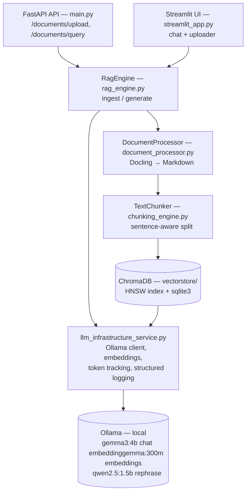

# Enterprise Knowledge AI - Document RAG Service

A local Retrieval-Augmented Generation (RAG) platform for ingesting business documents (PDF, DOCX, PPTX, images, ZIP) and answering questions over them using a self-hosted LLM stack (Ollama). It ships with two front doors onto the same engine: a multi-tenant **FastAPI** REST API ([main.py](main.py)) and a single-user **Streamlit** chat UI ([streamlit_app.py](streamlit_app.py)).

## Architecture



### Components

| Component | File | Responsibility |
|---|---|---|
| REST API | [main.py](main.py) | Multi-tenant upload/query endpoints, ZIP handling, chat persistence |
| Chat UI | [streamlit_app.py](streamlit_app.py) | Single-user interactive front end over the same `RagEngine` |
| RAG orchestration | [rag_engine.py](rag_engine.py) | Dedup, chunk, embed, store, retrieve, prompt, generate |
| Document parsing | [document_processor.py](document_processor.py) | Docling-based conversion of PDF/DOCX/PPTX/images to Markdown |
| Chunking | [chunking_engine.py](chunking_engine.py) | Sentence-aware splitting to `ChunkLength` (default 512 chars) |
| LLM/embedding infra | [llm_infrastructure_service.py](llm_infrastructure_service.py) | Config loading, Ollama chat/embedding clients, LLM routing, token usage tracking, file logging |
| Prompts | [docsIntegrationPromptManager.py](docsIntegrationPromptManager.py) | QA prompt, chat-history reframing prompt, response-rephrase prompt |
| Runtime config | [docsagentconfig.json](docsagentconfig.json) | Paths, model names, thresholds (`SimilarityTopK`, `NodeScore`, etc.) |
| Vector store | `vectorstore/` | Chroma persistent client (HNSW index + `chroma.sqlite3`) |
| Logs / metadata | `logs/`, `metadata/` | Per-space ingestion & query logs, chat transcripts, token usage (feather/zstd) |

### Data flow

**Ingestion** (`RagEngine.ingest_document`): save upload → if `.zip`, extract and filter by `document_validate` extensions → Docling converts to Markdown → SHA-256 content hash computed → duplicate check by `file_name` *and* by content hash (skips re-ingesting renamed-but-identical files) → `TextChunker` splits into chunks → each chunk embedded via the Ollama embedding model and written to a Chroma collection as a `TextNode` → the engine asks itself to summarize the new document and stores that summary + metadata in a parallel `<collection>_metadata` collection (used for the dedup/listing checks above).

**Query** (`RagEngine.generate_response`): if chat history exists, an LLM call reframes the question into a standalone query → query is embedded and run against Chroma via a `VectorIndexRetriever` (`SimilarityTopK` = 10) → nodes below the `NodeScore` threshold (0.2) are dropped → surviving chunks are joined into context and passed through `DEFAULT_QA_PROMPT` → Ollama chat model generates the answer → (API path only) a second LLM pass reformats the answer via `RESPONSE_REPHRASE_PROMPT` → answer + source citations (file name, link, score) returned.

### Tech stack

Python 3.12 · FastAPI · Streamlit · ChromaDB · LlamaIndex · Docling · Ollama (`gemma3:4b` generation, `embeddinggemma:300m` embeddings, `qwen2.5:1.5b` rephrasing) · httpx · pandas/pyarrow (token analytics) · Poetry

## Business Impact

### Document data stays private
All inference — chat generation, embeddings, and response rephrasing — runs through a self-hosted [Ollama](https://ollama.com) instance on `127.0.0.1:11434` ([llm_infrastructure_service.py](llm_infrastructure_service.py)). Document content, chunks, and user queries are never transmitted to a third-party LLM API — every byte of business knowledge stays inside the organization's own infrastructure, from upload to answer.

### Free of cost at the inference layer
Generation (`gemma3:4b`), embeddings (`embeddinggemma:300m`), and rephrasing (`qwen2.5:1.5b`) all run on open-weight models served locally by Ollama instead of a metered cloud API. That means there's no per-token or per-call billing anywhere in the pipeline — ingesting, summarizing, and querying documents scales with zero incremental inference cost.

### Built-in token accounting for usage-based chargeback
Even though inference itself is free, every LLM call is still metered: `TokenTrackingService.persist_token_usage` ([llm_infrastructure_service.py:126-215](llm_infrastructure_service.py#L126-L215)) records input/output/total token counts per request, tagged by workspace (`spaceid`) and user, and persists them under `metadata/tokenDetails/`. This gives the business a ready-made usage ledger — consumption can be aggregated and apportioned per workspace or user for internal cost allocation or showback, without ever depending on a paid LLM provider's billing.

### RAG accuracy
The pipeline is built around several choices that directly improve answer quality:
- **Sentence-aware chunking** ([chunking_engine.py](chunking_engine.py)) keeps each chunk within `ChunkLength` while respecting sentence boundaries, so retrieved context reads as coherent passages rather than fragments.
- **Content-hash deduplication** (`generate_content_hash` in [rag_engine.py](rag_engine.py)) keeps the index free of duplicate content even when the same document is re-uploaded under a different name, so retrieval isn't diluted by repeated matches.
- **Similarity-score filtering** (`NodeScore` threshold) discards weakly-relevant chunks before they reach the prompt, keeping answers grounded in genuinely relevant context.
- **Chat-history reframing** rewrites follow-up questions into standalone queries before retrieval, so multi-turn conversations stay accurate instead of retrieving against an ambiguous fragment.
- **Grounded QA prompting** (`DEFAULT_QA_PROMPT`) directs the model to answer strictly from retrieved context, preserving source terminology and clearly flagging when the knowledge base doesn't contain an answer.
- **Source-cited responses** return the originating file, link, and relevance score alongside every answer, so business users can verify and trace any AI-generated response back to the source document.

## Getting started

```bash
poetry install
# Ollama must be running locally with the models referenced in docsagentconfig.json
ollama serve

poetry run uvicorn main:app --reload    # API on :1232
poetry run streamlit run streamlit_app.py    # UI on :8501
```

Configuration lives in [docsagentconfig.json](docsagentconfig.json) — model names, Ollama endpoints, chunk size, retrieval thresholds, and all storage paths. The paths in that file (and the `CONFIG_FILE_PATH` constant in [llm_infrastructure_service.py](llm_infrastructure_service.py)) are absolute and machine-specific — update them to match your own environment before running.
